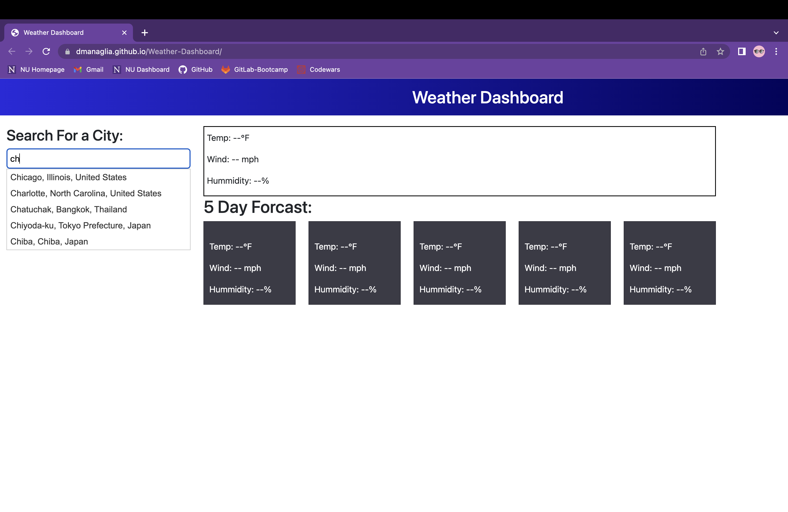
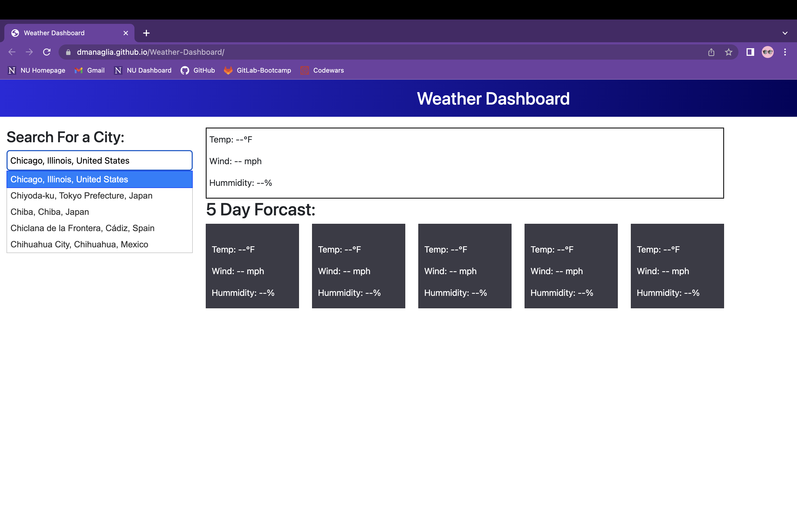
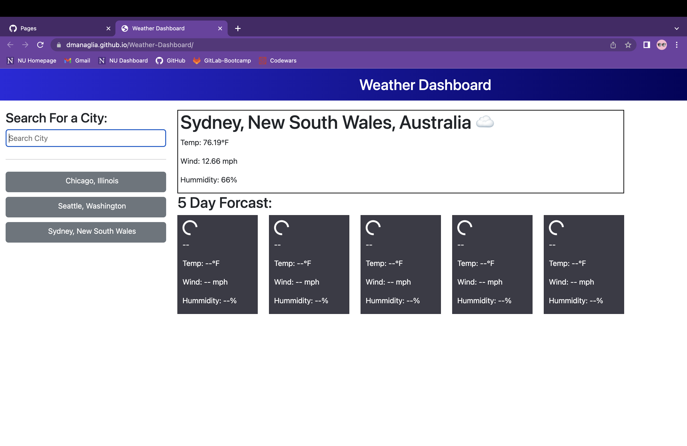
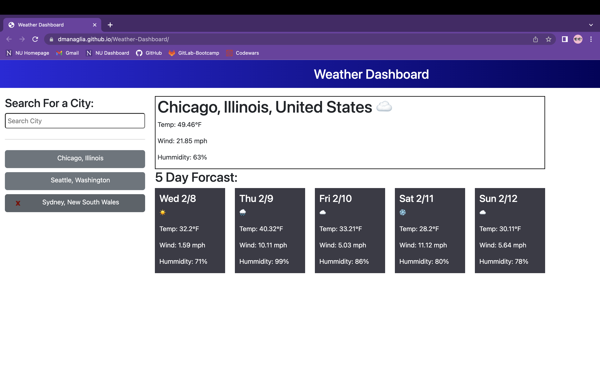
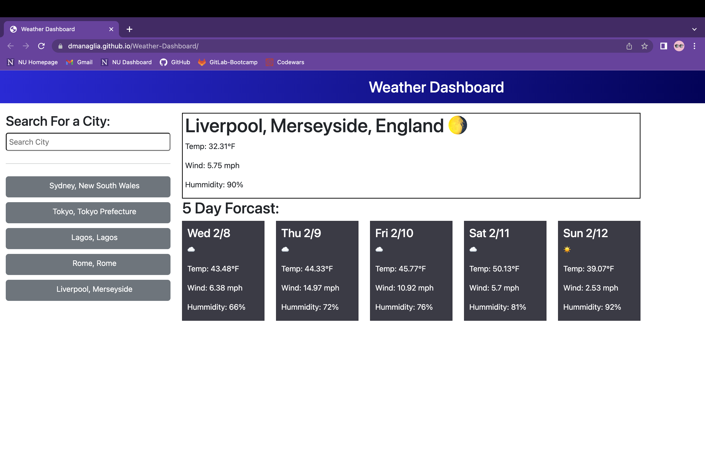

# Weather-Dashboard

This webpage is a simple weather dashboard allowing the user to view the weather of a perticular town or city throuhgout the world. The webpage will also display a 5 day forcast so the user knows the weather of any upcoming days as well. A very handy tool for any traveler or anytime someone wishes to schedule their plans around the weather. Users search results are stored in the lefthand side of the webpage. This acts as a city favorites list, which the user can modify at any time. Every search will automatically be added to the favorites list, the user simply has the the ability to remove any cities from that list by hovering over that city and clickng on the red X.

Building the webpage was great practice working with third party API's, fetching data, sifting through the data and displaying the desired information back to the user. The webpage utilizes the open weather maps API for information on the weather, as well as the mapbox API which provides information about cities. 

I did have some difficulty figuring out how to hide the mapbox API access token since this repo is public and I need to provide access to the grader. Without any current knowledge on backend developement I was hidding my API keys in my local variables as I built the project. I knew this wouldn't work once I turned in the project so I discovered I could restrict the access token to a specific URL so that the token could not be stolen and utilized to the point where my free amound of API calls were used up. I restricted the access token to my deployed live link URl so I do not need to worry about that happening.

## Installation

No installation necessary just click the link below to view!

[Click here to go to live link!](https://dmanaglia.github.io/Weather-Dashboard/)

## Usage

The webpage itself is very easy to use and intuitive. Start by searching up a city and you will be presented with a dropdown list of options that match your search text. You must select one of these options either by clicking on it or by using the arrow keys and hitting return. 

The webpage will then make a call to a server to retrieve data on the current and upcoming weather of that city. This may take a moment or two, so the wepage will visually display that it is loading until the information has been retrieved. 

Once you make a search the city name and state will appear on the left side of the screen. By clicking on this button you can revisit the weather information of that city easily at any time. If you refresh the page this list will remain. For all purposes it acts like a favorite cities list so you do not have to continuially search up cities. If at any point you wish to remove a city from the list you can hover over the button and red X will appear. By clicking on that button the city will be removed from your favorites. 

For now all cities searched will be added to the list, but a future version of this webpage will allow users to manually decide if they wish to add the city to their favorites or if they just wanted to view it once. 

## Cedits

[Bootstrap](https://getbootstrap.com/)

I utilized the bootstrap API for general styling and spacing for my webpage.

[day.js.org Formatting](https://day.js.org/docs/en/display/format)

I utilized the Day.js API for formating the future 5 days in the forcasted list. 

[jQuery Script](https://jquery.com/)

I utilized the jQuery API for a cleaner JavaScript syntax.

[jQuery UI autocomplete](https://jqueryui.com/autocomplete/)

I utilized the jQuery user interface API for the autocomplete widget I placed on my webpage. The API contains both script and stylesheet necessary for the autocomplete widget.

[openweathermaps API](https://openweathermap.org/forecast5)

I utilized the open weather maps free API for information on the weather across the world. The server can take in city name and country as a parameter, or as I chose, the coordinates of that city.

[mapbox API](https://docs.mapbox.com/mapbox-search-js/api/web/autofill/)

For the city search input element I utilized the mapbox API for information on cities around the world. 

[mapbox geocoding API](https://docs.mapbox.com/mapbox-gl-js/example/mapbox-gl-geocoder-no-map/)

Through use of the specific mapbox geocoding API I was esily able to retrieve a list of the top 5 most similar city names to a given user input.

## License

Please refer to the LICENSE in the repo.

## Features

I initially did not need the mapbox API to complete the webpage. However once I had the webpage working I found it to be easier to display a list of cities to the user as they were typing to avoid the user mispelling a city. I also thought it would just be nice practice to work with jQuery's automplete and an additional API. It was initially tricky to find the right API to retrieve information on cities around the world. When I found mapbox I thought it was a bit much since the API is mainly for building digital and interactive maps. However in the mapbox website they had a couple pre-build autocomplete code snippets that seemed to be exactly what I was looking for. 

At first I found an code snippet that acted much like google maps, and would offer a dropdown for exact addresses and roads. Since I just wanted the city name I tried playing around with the parameters and options of this prebuilt function to offer only information about cities and town in the dropdown, however this couldn't be done since the function was built for an actual map and therefore didn't allow for such a generic search.

I then found a different function that allowed for a more generic search without a map. This gave me exactly what I was looking for, but rather than utilizing an input element the function called for a non-semantic div element. Although this was better, it didn't integrate well with my pre-existing webpage. However, by playing around with the function I was able to track the URL calls it was making to the server.

By utililizing this URL I was able to implement my own version of the function with the use of a keyup event listener and the jQuery UI automplete widget. It was fairly easy once I reached this point. With every key the user presses while inside the input element, the code makes a call to the mapbox geocoding API with a query that holds the current search value, the server then automatically respondes with a list of 5 cities that match that search value closely. So every time the user presses a key a new automplete widget is created with a new list of available tags, and for each tag there is also an object created that holds all the information I needed about any given city.

Once the user selects a city from the autocomplete dropdown, coordinates of that city are passed to the openweathermaps api. This was nice since it gives users the ability to search for cities all over the world even if they are unsure of the spelling.

Having tested it a lot myself, I have found that some cities are not in the mapbox geocoding server list and I am unsure as to why. Mainly I have found that cities in China do not show up. Every city I can think of in America is available as well as most major cities around the world. 

Given more time I would like to allow the user to type in their own string even if it does not appear on the dropdown and submit it. This is the design I originally had, but it only worked for American cities. I could either ask the user to specify the country before they search the city and pass that information directly to the openweathermap API or more thoroughly check the mapbox API documentation to understand why I am not getting chinese cities.